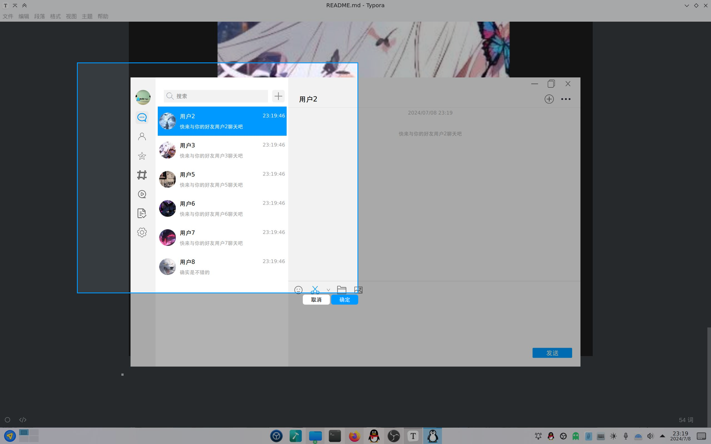

# OICQ仿QQ9即时聊天

- 添加好友请求页面

  - 拒绝或同意两个选项
  
  

- 添加好友界面
  - 通过输入用户id添加好友
  - 对自己，已添加的用户，不存在的id，进行不同的返回提示

  

- 聊天界面

  - 支持发送文字，图片，表情，文字图片表情混合发送，发送文件

  

- 图片浏览器界面

  - 当前聊天窗口的图片阅览，支持旋转放大缩小拖动阅览
  
  

- 头像上传界面

  

- 截图界面

  - 支持选择隐藏窗口或不隐藏窗口
  
  

- 部署到应用菜单

  - 就是将desktop文件放到`/usr/share/applications`目录下

    
